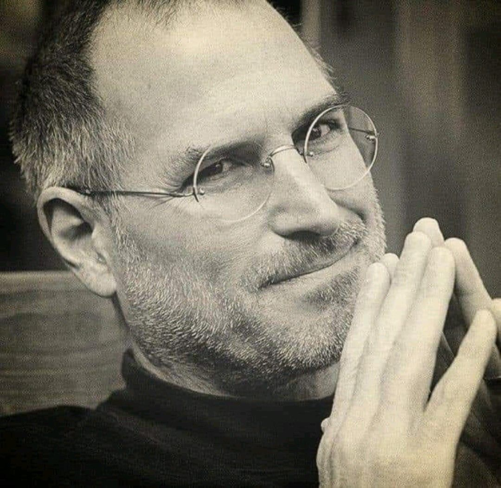

# Steve Jobs

# Steve Jobs 

Vždycky, když se nechám v životě strhnout do stavu "že nic nestíhám" a jsem uvězněna napůl mezi prací a rodinou a mám pocit, že nic nedělám pořádně, je dobré se zastavit a podívat se na to s nadhledem. 
Dovolím si sdílet pár slov, která ten nadhled dobře popisují. 
-------------------------------

Poslední slova Steva Jobse, miliardáře, zemřel v 56 letech:

„Dosáhl jsem vrcholu úspěchu v podnikání. " V očích jiných je můj život úspěch.
Kromě práce jsem však měl málo radosti.
Nakonec je bohatství jen fakt, na který jsem si zvykl. 

Právě teď, ležím na nemocničním lůžku a vzpomínám, celý svůj život si uvědomuji, že veškeré uznání a bohatství, na které jsem byl tolik pyšný, vybledlo a stalo se bezvýznamným tváří v tvář…

Můžete si najmout někoho, kdo bude řídit vaše auto nebo za vás vydělávat peníze, ale nemůžete najmout někoho, kdo by za vás byl nemocný a zemřel.

Ztracené materiální věci lze znovu najít. Ale existuje jedna věc, kterou nelze nikdy najít, když je ztracená: život.

Ať se právě nacházíme v jakékoli životní fázi, časem budeme čelit dni, kdy se opona zavře.

Milujte svou rodinu, manželku, děti a přátele... Chovejte se k nim správně.

Važte si jich.

Jak stárneme a jsme moudřejší, pomalu si uvědomujeme, že hodinky za 300 nebo 30 $ ukazují stejný čas.

Ať už máme peněženku nebo kabelku za 300 nebo 30 $, částka uvnitř je stejná.

Ať už řídíme auto za 150 000 $ nebo auto za 30 000 $, cesta a vzdálenost jsou stejné a dosáhneme stejného cíle.

Ať už vypijeme láhev vína za 1000 $ nebo 10 $, kocovina je stejná.

Ať už dům, ve kterém žijeme, má 100 nebo 1000 metrů čtverečních, samota je stejná.

Uvědomíte si, že vaše skutečné vnitřní štěstí nepochází z materiálních věcí tohoto světa.

Ať už cestujete první třídou nebo ekonomickou třídou, pokud letadlo spadne, jdete ke dnu s ním...

Proto doufám, že si uvědomujete, když máte přátele, bratry a sestry, se kterými diskutujete, smějete se, mluvíte, zpíváte, mluvíte o severovýchodě nebo nebi a zemi,... tohle je to skutečné štěstí!!

Nezpochybnitelná skutečnost života:
Nevychovávejte své děti tak, aby byly bohaté.

Vzdělávejte je, aby byli šťastní.

Až vyrostou, budou znát hodnotu věcí a ne cenu. "

Jak krásný je život

#zivotjekrasny

